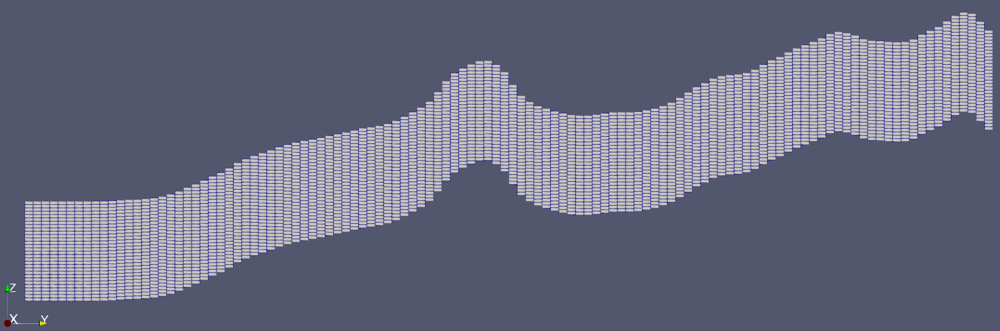

# Tomofast-x User Manual

**Geophysical 3D parallel potential field joint inversion package**

*Code version v.2.0.9*

By Vitaliy Ogarko

Centre for Exploration Targeting, The University of Western Australia, 2025.

---

# Contents

- [Introduction](#introduction)
- [Code compilation](#code-compilation)
- [Description of code parameters](#description-of-code-parameters)
  - [Global (global)](#global-global)
  - [Model grid (modelGrid)](#model-grid-modelgrid)
  - [Data (forward.data)](#data-forwarddata)
  - [Magnetic field (forward.magneticField)](#magnetic-field-forwardmagneticfield)
  - [Depth weighting (forward.depthWeighting)](#depth-weighting-forwarddepthweighting)
  - [Sensitivity kernel (sensit)](#sensitivity-kernel-sensit)
  - [Matrix compression (forward.matrixCompression)](#matrix-compression-forwardmatrixcompression)
  - [Prior model (inversion.priorModel)](#prior-model-inversionpriormodel)
  - [Starting model (inversion.startingModel)](#starting-model-inversionstartingmodel)
  - [Inversion (inversion)](#inversion-inversion)
  - [Model damping (inversion.modelDamping)](#model-damping-inversionmodeldamping)
  - [Joint inversion (inversion.joint)](#joint-inversion-inversionjoint)
  - [Disjoint interval bound constraints (inversion.admm)](#disjoint-interval-bound-constraints-inversionadmm)
  - [Damping-gradient constraints (inversion.dampingGradient)](#damping-gradient-constraints-inversiondampinggradient)
  - [Cross-gradient constraints (inversion.crossGradient)](#cross-gradient-constraints-inversioncrossgradient)
  - [Clustering constraints (inversion.clustering)](#clustering-constraints-inversionclustering)
- [Description of input data formats](#description-of-input-data-formats)
  - [Data file format](#data-file-format)
  - [Model grid file format](#model-grid-file-format)
  - [Prior and starting models](#prior-and-starting-models)
  - [Disjoint interval bound constraints (ADMM)](#disjoint-interval-bound-constraints-admm)
  - [Clustering constrains](#clustering-constrains)
- [Description of the code output files](#description-of-the-code-output-files)
  - [Data files](#data-files)
  - [Model files](#model-files)
  - [Visualization files](#visualization-files)
  - [Analysis files](#analysis-files)
  - [Screen log](#screen-log)
- [References](#references)

# Introduction

**Tomofast-x** is a powerful 3D parallel inversion platform designed for
single-domain or joint inversion of gravity and magnetic data. It also
supports the inversion of gravity gradiometry data (FTG) and can handle
multiple-component magnetic data. The platform is capable of inverting
for the magnetization vector, including remanence, while incorporating
petrophysical constraints [1-6]. To improve the final model by
incorporating geological and petrophysical information into the
inversion, the code supports various constraints. These include a prior
model, cross-gradient constraints, 'smart' gradients, disjoint
interval bounds, and clustering constraints. For details on the
equations solved and the types of constraints applied, refer to
reference [1] and the sources cited therein.

The model grid can accommodate arbitrary surface topography. Unlike
other approaches, Tomofast-x does not require the addition of 'air
cells' to model the topography. As a result, incorporating topography
does not incur additional computational costs.

For visualizing the output 3D models, the code generates results in the
VTK file format (binary version for reduced file size). These files can
be easily viewed using the free, open-source software ParaView.

The code is written in Fortran 2008 and leverages classes and modern
vectorization compiler features to enhance performance. It is fully
parallelized using the MPI library, which is the only external
dependency. This minimal dependency makes the code easy to build on
various machines and straightforward to extend or extract specific
components.

The parallel mode enables faster performance and the ability to solve
much larger problems by overcoming memory limitations of a single
machine. The code can run in parallel on supercomputers with distributed
memory systems, utilizing thousands of CPUs, or on modern computers and
notebooks with shared memory systems, using anywhere from 2 to 40 CPUs.

Critical parts of the code are covered by automated unit tests, which
include tests for parallel execution. The code with some examples can be
downloaded from the following GitHub repository:

<https://github.com/TOMOFAST/Tomofast-x>

You're welcome to submit pull requests for new features, bug fixes,
optimizations, additional examples, and more. If you use this code or
any of its components, please remember to cite references [1] and
[2].

# Code compilation

The code compilation is based on Make, which is a build automation
tool. It is assumed that the code is compiled in Linux environment, even
though a Windows build is also possible (e.g. using WSL). To compile the
code, you need:

-   Compiler GCC, or Intel Fortran compiler.

-   MPI library (such as OpenMPI or MPICH).

The Makefile is contained in the root folder and should be used to
compile Tomofast-x. Compiling the code is a necessary step to be able to
run inversions.

To compile the code run the make command in the code directory as:

```bash
make
```

To clean the compilation files (to perform a clean compilation), run:

```bash
make clean
```

To run the code with your parameter file:

```bash
mpirun -np <Number-of-cores> ./tomofastx -j <Parfile path>
```

To run unit tests in serial:

```bash
./runtests.sh
```

and in parallel:

```bash
mpirun -np 3 ./runtests.sh
```

Note, that the Makefile by default assumes the GCC compiler. It can be
switched to the Intel compiler by setting "FC = mpiifort" and switching
the FLAGS variable definition to the Intel one (commented out by
default).

For full debugging information, in the Makefile different sets of FLAGS
are provided. The flags to output the vector optimization report,
OPT_INFO, can also be enabled.

# Description of code parameters

To run the code, you need to specify various configuration parameters,
including paths to input data files, free parameters for the cost
function and constraints, solver settings, and additional options.

All input parameters are defined in a single text file called the
Parfile, which is organized into several categories to separate
different parameter types. For a comprehensive Parfile that lists all
available input parameters along with their default values and
descriptions, refer to the file **Parameters_all.txt** located in the
root directory of the code. A description of each parameter category,
along with its name prefix (indicated in brackets), is provided below.

## Global (global)

Contains the path to the output data folder, along with parameters for
unit conversions and Z-axis orientation.

## Model grid (modelGrid)

Contains the dimensions of the model grid, and paths to the model grid
files. For details on the file format, refer to the next section of this manual.

## Data (forward.data)

Contains the number of data points and the path to the data file, which includes both the data grid and observed values to be inverted. 
For details on the file format, refer to the next section of this manual.

## Magnetic field (forward.magneticField)

Constants describing the external (Earth) magnetic field, necessary for
calculating the forward magnetic problem (including
inclination/declination angles, field intensity, etc.).

## Depth weighting (forward.depthWeighting)

Contains parameters to configure the depth weighting used. The **type**
parameter specifies the type of depth weighting. The type 1, is based on
the inverse power law of the distance from the surface to the $j$-th grid
cell, defined as:

$$W(j) = \frac{1}{( Z_{j} - Z_{0} )^{q/2}}$$

The corresponding free parameters, power $q$ and a shift $Z_{0}$ can be
specified in parameters **power** and **Z0**, for gravity and magnetic
problems separately. Note that as the magnetic field attenuates with
distance faster than gravitational one, the power $q$ for magnetic
problem is usually higher. The exact values of the powers should be
configured for a model of interest, as they depend on the model grid
(cells) dimensions, and data locations.

The depth weighting type 2 corresponds to the depth weighting based on
the distance to data (i.e., it varies in all model dimensions). It is a
preferable option for models with non-flat topography. For more details,
see Ref. [1].

## Sensitivity kernel (sensit)

This section allows you to set a flag to reuse an already calculated
sensitivity kernel. The path to the sensitivity kernel is specified in
the parameter **folderPath**. This feature is useful for saving
computation time when recalculating the sensitivity kernel is not
necessary, such as when changing constraint parameters or types, or when
using a different background field for data reduction.

## Matrix compression (forward.matrixCompression)

This section allows you to configure sensitivity matrix compression
using wavelet compression, which is especially useful for running large
models on machines with limited memory and significantly speeds up
calculations. The level of compression can be adjusted by modifying the
compression rate parameter, where a value of 1 corresponds to the full
matrix (i.e., no compression). The compression error is logged for
reference.

## Prior model (inversion.priorModel)

The prior (or reference) model is used to apply model damping
constraints to the cost function (see Ref. [2]). The parameter
**type** defines how the prior model is initialized. If type 1 is
selected, all values in the prior model will be initialized from a value
specified in the **value** parameter. If type 2 is chosen, the prior
model will be read from a file, with the file path specified in the
**file** parameter.

## Starting model (inversion.startingModel)

The starting model serves as the initial model in the iterative
inversion process. The input parameters are the same as those for the
prior model (see above). It is often a good practice to set the starting
model to zero to avoid propagating any 'bad' structures into the
inversion results, as these can be difficult to remove due to
'null-space' issues.

## Inversion (inversion)

This section contains the number of nonlinear inversion iterations
(major loop), **nMajorIterations**, and several stopping criteria for
the inversion solver:

\(1\) based on the number of solver iterations (minor loop),
**nMinorIterations**,

\(2\) based on the smallest relative residual, **minResidual**.

\(3\) based on the target data misfit (specified in SI units),
**targetMisfit**.

It is recommended to keep the first two parameters equal to 100 and
1e-13, respectively. While the number of major iterations can depend on
the type of constraints added to the inversion. For example,
unconstrained inversions require 1-2 major iterations, while the
petrophysical (ADMM) constraints typically require 20-100 major
iterations.

## Model damping (inversion.modelDamping)

Contains a damping weight $\alpha$ and the $L_{p}$ norm power $p$ for
the model damping term, see Refs. [2, 8]. Note different values of
$\alpha$ for gravity and magnetic problems, due to different scale of
physical units. When $\alpha = 0$ the model damping is not active, even
though the depth weighting is always active, via the sensitivity matrix
preconditioning by $W^{- 1}$.

## Joint inversion (inversion.joint)

This section contains weights used to balance the gravity and magnetic
inversions in joint inversion (e.g., when using cross-gradient or
clustering constraints). The **problemWeight** is applied to the
respective data misfit and model damping terms. The
**columnWeightMultiplier** is applied to the columns of the
least-squares matrix, effectively performing linear model mapping.

## Disjoint interval bound constraints (inversion.admm)

This section defines parameters for the disjoint interval bound
constraints (ADMM). To enable these constraints, set the **enableADMM**
flag to 1. Local bounds for each cell and lithology are specified in the
bound file (**boundsFile**), while global bounds (same for all cells)
can be defined directly in the Parfile via the **bounds** parameter. For
a description of the bound file format, see Section 5.4. The bound
constraint terms are added to the misfit function with a corresponding
global ADMM weight (**weight**).

The ADMM weight should be adjusted to suit the specific problem for
optimal results. Alternatively, the code can dynamically adjust the ADMM
weight by specifying the **dataCostThreshold** and **weightMultiplier**
parameters. In this case, the weight is multiplied by the specified
multiplier when the relative data cost falls below the given threshold.
For example, dynamic ADMM constraints are used to apply positivity
constraints in the inversion of magnetic data in the
"*parfiles/Parfile_magbubble_slice.txt*".

When bound constraints are enabled, the number of major iterations
should be around 20-100 to allow the model parameters to move within the
specified bounds. Convergence progress can be monitored by checking the
ADMM cost in the log and the costs file. For more details on disjoint
interval bound constraints, refer to Ref. [3].

## Damping-gradient constraints (inversion.dampingGradient)

This section contains parameters for setting damping-gradient
constraints. These constraints can be either a standard model gradient
term (when **weightType**=1) or a 'smart' gradient (when
**weightType**=2), where the model gradient is preconditioned with local
weights. These local weights can be based on the second model. For more
details on 'smart' gradient constraints, see Refs. [4-5].

## Cross-gradient constraints (inversion.crossGradient)

This section contains parameters for setting up cross-gradient
constraints for joint inversion. The constraints are enabled when the
weight parameter is greater than zero. For more details on
cross-gradient constraints, see Ref. [6].

## Clustering constraints (inversion.clustering)

This section contains parameters for setting up clustering constraints,
which can be used in both single and joint inversions. The constraints
are enabled when the respective **weight** parameter is greater than
zero. For details on the file formats for the mixture file
(**mixtureFile**) and the cell weights file (**cellWeightsFile**), refer
to Section 5.5. For more information on clustering constraints, see Ref.
[7].

# Description of input data formats

Tomofast-x requires several input data files to specify the following:

-   Observed data values and positions (data grid)

-   Model grid (cells)

-   Prior and starting models (optional)

-   Various constraints (optional)

All input files are in ASCII (text) format, with 3D coordinates provided
in a Cartesian coordinate system. By default, the Z-axis points
downwards, meaning Z-values below the ground are positive, and Z-values
above the ground are negative. All physical units used in the code are
SI units, unless explicitly stated otherwise. Note that the direction of
the Z-axis can be flipped using the **zAxisDirection** parameter.
Additionally, the model and data units can be adjusted using the
**dataUnitsMultiplier** and **modelUnitsMultiplier** parameters.

Examples of input data files are available in the *data/gravmag* folder.
A detailed description of the different types of input data is provided
below.

## Data file format

The data grid and data values files are stored in the **dataGridFile** file.
The paths to this file is specified in the Parfile
sections **forward.data.grav** and **forward.data.magn** for gravity and
magnetic problems, respectively. For more details, refer to the file
*Parameters_all.txt*.

The first line contains the number of data values, followed by lines
that include the 3D data positions (x, y, z) and the corresponding data
value, all separated by spaces, as shown below:

```
N
p_x(1)  p_y(1)  p_z(1)  d(1)
...
p_x(N)  p_y(N)  p_z(N)  d(N)
```

Here $N$ is the number of data values, `p_x(i) p_y(i) p_z(i)` is
the 3D position of the *i*-th data, and $d^{i}$ is the value of the
*i*-th data. For multicomponent data (e.g., gravity gradiometry), each
data component is specified in a separate column.
Note that the default Tomofast-x Z-axis points downward, so data Z-positions above the surface should have negative signs.

For tests with synthetic models, you can invert the forward-modeled data calculated from the synthetic model within the same inversion run. 
To do this, enable the **useSyntheticModelForDataValues** flag and provide the path to the synthetic model in the **syntheticModelFile** parameter.

## Model grid file format

The paths to model grid files are specified in the Parfile sections
**modelGrid.grav** and **modelGrid.magn** for gravity and magnetic
problems, respectively. For more details, refer to the file
*Parameters_all.txt*.

The model grid consists of a set of non-overlapping rectangular prisms,
allowing for the specification of models with various shapes. This
format also enables the simulation of surface topography and
continent-ocean boundaries.

The first line contains the number of model cells. Each subsequent line
includes the cell coordinates, model value and 3D cell index, all
separated by spaces, as shown below:

```
N
X_min(1)  X_max(1)  Y_min(1)  Y_max(1)  Z_min(1)  Z_max(1)  i(1)  j(1)  k(1)
...
X_min(N)  X_max(N)  Y_min(N)  Y_max(N)  Z_min(N)  Z_max(N)  i(N)  j(N)  k(N)
```

Here $N$ is the number of model cells,
`X_min(i) X_max(i) Y_min(i) Y_max(i) Z_min(i) Z_max(i)`
are the min/max coordinates of the X, Y, Z planes of the cell
(rectangular prism), $i^{i}j^{i}k^{i}$ is the 3D
cell-index (integer).

Surface topography can be specified by draping the mesh beneath the
topography. This approach eliminates the need to define air cells,
thereby reducing the grid size and memory requirements, as illustrated
in Figure 1.



Figure 1. Example of a model grid with topography. Note that the mesh is
effectively draped beneath the topography.

## Prior and starting models

The prior and starting models can be defined either from an input
constant value (specified in the Parfile) or from files. To define
uniform models using a constant value, set the model **type** to 1 and
specify the corresponding model **value**. To define models from files,
set the model **type** to 2 in the Parfile. In this case, the model file
path. should be specified in the **file** parameter. The file format is
as follows: the first line contains the model size, followed by a list
of model values in the same order as the input model grid. This format
matches the output model, enabling direct use of the inverted model as a
starting model for a new inversion.

## Disjoint interval bound constraints (ADMM)

Local bound constraints require a bounds file. The path to the bounds
files is specified in the **boundsFile** parameter. The format of the
bounds file is as follows:

```
N  L
m_min(1,1)  m_max(1,1)  ...  m_min(1,L)  m_max(1,L)  w(1)
...
m_min(N,1)  m_max(N,1)  ...  m_min(N,L)  m_max(N,L)  w(N)
```

Here $N$ is the number of model cells, $L$ is the number of bounds
(lithologies), and each subsequent line contains the minimum and maximum
bounds for every lithology ($l = 1,\ldots L$), for the *i*-th model cell
($i = 1,\ldots N$), followed by the the local weight $w^{i}$. The local
weight represents the degree of uncertainty for the corresponding
constraint. If all bound constraints are equally uncertain, all weights
should be set to unity. Examples of such bound constraint files can be
found in the "*data/gravmag/mansf_slice*" folder.

## Clustering constrains

Clustering constraints require an input mixture file that describes the
clusters (**mixtureFile**). The format of the mixture file is as
follows:

```
n
w(1)  mu_G(1)  sigma_G(1)  mu_M(1)  sigma_M(1)  sigma_GM(1)
...
w(n)  mu_G(n)  sigma_G(n)  mu_M(n)  sigma_M(n)  sigma_GM(n)
```

Here, $n$ is the number of clusters, and each subsequent line defines,
for the *i*-th cluster, the local weight $w_{i}$, the mean and standard
deviation for gravity and magnetic problems ($\mu_{i}^{G}\sigma_{i}^{G}$
and $\mu_{i}^{M}\sigma_{i}^{M}$), and cross-term standard deviation
$\sigma_{i}^{GM}$ (in the multivariate normal distribution).

When the local type of constraints is selected (**constraintsType**=2),
the cell weights file (**cellWeightsFile**) must also be provided, in
the following format:

```
N  n
w(1,1)  ...  w(1,n)
...
w(N,1)  ...  w(N,n)
```

Here $N$ is the total number of cells, and $n$ is the number of
clusters. Each subsequent line contains the local cluster weights for
the *i*-th cell. For more details on clustering constraints, refer to
Ref. [7].

# Description of the code output files

Tomofast-x generates several types of output files, which are stored in
the output folder specified by the **global.outputFolderPath** parameter
in the Parfile. The types of output files produced include:

-   Data files (txt)

-   Model files (txt)

-   Visualization files (vtk)

-   Analysis files (txt)

-   Code logs (written to the screen)

Each file type is described in more detail below. Note that the file
names provided are for the gravity problem; for magnetic problems, the
files have the same name, with the 'grav' prefix replaced by 'mag'.

## Data files

The output data files follow the same format as the input data files and
correspond to the gravity and magnetic problems, named with the prefixes
"grav" and "mag." The files for the gravity problem are:

-   **grav_calc_read_data.txt** -- Forward data calculated from the
    synthetic model (stored in the model grid).

-   **grav_observed_data.txt** -- Observed data (identical to the input
    data).

-   **grav_calc_prior_data.txt** -- Data response of the prior model.

-   **grav_calc_starting_data.txt** -- Data response of the starting
    model.

-   **grav_calc_final_data.txt** -- Data response of the final model
    (obtained from the inversion of the observed data).

-   **grav_misfit_final_data.txt** -- Data misfit of the final model.

The code also generates corresponding data files in vtk format for
visualisation in Paraview.

## Model files

The final model is stored in ASCII format in the *model* folder, which
is created inside the output folder. It contains the model size,
followed by a list of model values in the same order as the input model
grid.

## Visualization files

To visualize and analyze the final model, the code also generates models
in binary vtk format, which can be viewed using the free open-source
software Paraview. For example, for the gravity problem, the generated
files are:

-   **grav_read_model3D_full.vtk** -- the synthetic model (stored in the
    model grid).

-   **grav_prior_model3D_full.vtk** -- the prior model.

-   **grav_starting_model3D_full.vtk** -- the starting model.

-   **grav_final_model3D_full.vtk** -- the final model obtained after
    inversion.

The code also generates vtk files with model slices (profiles) that cut
the model in half along the x-, y-, and z-directions. The filenames are
labelled with '**half_x**', '**half_y**', and '**half_z**',
respectively.

The code also generates corresponding data files (including data misfit)
in the vtk format for visualisation in Paraview. These files are
labelled with the '**data\_**' prefix.

## Analysis files

The code also produces some additional files for various analysis (e.g.
convergence):

-   **costs.txt** -- Contains various convergence information,
    summarized in the table below:

| Column | Meaning |
|--------|---------|
| 1 | Major iteration number |
| 2 | Data cost (misfit) for gravity problem |
| 3 | Data cost (misfit) for magnetic problem |
| 4 | Model cost for gravity problem |
| 5 | Model cost for magnetic problem |
| 6 | ADMM cost for gravity problem |
| 7 | ADMM cost for magnetic problem |
| 8 | ADMM weight for gravity problem |
| 9 | ADMM weight for magnetic problem |
| 10 | Damping gradient cost in X-direction for gravity problem |
| 11 | Damping gradient cost in Y-direction for gravity problem |
| 12 | Damping gradient cost in Z-direction for gravity problem |
| 13 | Damping gradient cost in X-direction for magnetic problem |
| 14 | Damping gradient cost in Y-direction for magnetic problem |
| 15 | Damping gradient cost in Z-direction for magnetic problem |
| 16 | Cross-gradient cost in X-direction |
| 17 | Cross-gradient cost in Y-direction |
| 18 | Cross-gradient cost in Z-direction |
| 19 | Clustering cost for gravity problem |
| 20 | Clustering cost for magnetic problem |

-   **model/clustering_data.txt** -- Generated when clustering
    constraints are used. It contains model cell data followed by
    Gaussian mixture value, two derivatives (with respect to gravity and
    magnetic models), and the value of each mixture element (local
    Gaussian, one per cluster).

## Screen log

During code execution, information about the current state of
convergence is generated and written to the screen log. This information
helps to understand how input parameters affect the rate and quality of
convergence. One key parameter to monitor during the inversion process
is the relative data misfit, defined as:

$$cost = \frac{\lVert d_{calc} - d_{obs} \rVert_{2}}{\lVert d_{obs} \rVert_{2}}$$

This cost, along with other costs (as discussed in the previous
subsection), is also recorded in the *costs.txt* file. Additional
relevant information written in the log includes the solver residual and
the number of minor iterations, which can help analyze the stability of
the inversion process.

**If you have any questions or need assistance with using the code,
please feel free to contact me via email: <vogarko@gmail.com> (Vitaliy
Ogarko)**

# References

All papers listed below are using Tomofast-x for performing inversions.
For convenience, we split the papers to categories corresponding to the
type of constraints they use.

-   General code summary:

[1] V. Ogarko, K. Frankcombe, T. Liu, J. Giraud, R. Martin, and M.
Jessell (2024), "Tomofast-x 2.0: an open-source parallel code for
inversion of potential field data with topography using wavelet
compression", Geosci. Model Dev., 17, 2325--2345,
<https://doi.org/10.5194/gmd-17-2325-2024>

[2] J. Giraud, V. Ogarko, R. Martin, M. Lindsay, M. Jessell (2021):
Structural, petrophysical and geological constraints in potential field
inversion using the Tomofast-x open-source code, Geoscientific Model
Development Discussions, <https://doi.org/10.5194/gmd-2021-14>

-   Disjoint interval bound constraints:

[3] V. Ogarko, J. Giraud, R. Martin, and M. Jessell (2021), Disjoint
interval bound constraints using the alternating direction method of
multipliers for geologically constrained inversion: Application to
gravity data, GEOPHYSICS 86: G1-G11,
<https://doi.org/10.1190/geo2019-0633.1>

-   Smart-gradient constraints:

[4] J. Giraud, M. Lindsay, M. Jessell, and V. Ogarko (2020), Towards
plausible lithological classification from geophysical inversion:
honouring geological principles in subsurface imaging, Solid Earth, 11:
419--436, <https://doi.org/10.5194/se-11-419-2020>

[5] J. Giraud, M. Lindsay, V. Ogarko, M. Jessell, R. Martin, and E.
Pakyuz-Charrier (2019), Integration of geoscientific uncertainty into
geophysical inversion by means of local gradient regularization, Solid
Earth, 10: 193--210, <https://doi.org/10.5194/se-10-193-2019>

-   Cross-Gradient constraints:

[6] R. Martin, J. Giraud, V. Ogarko, S. Chevrot, S. Beller, P. Gégout,
M. Jessell (2021), Three-dimensional gravity anomaly data inversion in
the Pyrenees using compressional seismic velocity model as structural
similarity constraints, Geophysical Journal International 225(2):
1063--1085, <https://doi.org/10.1093/gji/ggaa414>

-   Clustering constraints:

[7] J. Giraud, V. Ogarko, M. Lindsay, E. Pakyuz-Charrier, M. Jessell,
R. Martin (2019), Sensitivity of constrained joint inversions to
geological and petrophysical input data uncertainties with posterior
geological analysis, Geophysical Journal International, 218(1):
666--688, <https://doi.org/10.1093/gji/ggz152>

-   $L_p$ norm-based model damping:

[8] R. Martin, V. Ogarko, D. Komatitsch, M. Jessell (2018), Parallel
three-dimensional electrical capacitance data imaging using a nonlinear
inversion algorithm and Lp norm-based model regularization,
Measurehment, 128: 428-445,
<https://doi.org/10.1016/j.measurement.2018.05.099>
